# Amazon Vine Analysis

## Overview of the Analysis
BigMarket, a startup that helps businesses optimize their marketing efforts. One of BigMarket's clients has requested some pretty hefty analytics - the client Sellby is about to release a large catalogue of products on a leading retail website. They wanted to know how the reviews of their products compare to the reviews of similar products sold by their competitors. They're also interested in enrolling in a program that gives out free products to select reviewers but they want to know if it's worth the cost. 

There are thousands of reviews and they're in words not numbers, so they were translated in order to analyze them. Sellby hired BigMarket because they believe in the power of big data. 

With the success of the Sellby project, now have been tasked to analyze Amazon reviews written by members of the paid Amazon Vine program. The Amazon Vine program is a service that allows manufacturers and publishers to receive reviews for their products. Companies like SellBy pay a small fee to Amazon and provide products to Amazon Vine members, who are then required to publish a review.

In this project, the Grocery dataset was chosen. Used PySpark to perform the ETL process to extract the dataset, transform the data, connect to an AWS RDS instance, and load the transformed data into pgAdmin. Next, used PySpark to determine if there is any bias toward favorable reviews from Vine members in the dataset. Finally, a summary is written of the analysis for Jennifer to submit to the SellBy stakeholders.

## Analysis Process

###  Performed ETL on Amazon Product Reviews
Used the cloud ETL process, to create an AWS RDS database with tables in pgAdmin, picked the Grocery dataset from the Amazon Review datasets, and extracted the dataset into a DataFrame. Transformed the DataFrame into four separate DataFrames that match the table schema in pgAdmin. The tables included:
* customers_table DataFrame
* products_table DataFrame
* review_id_table DataFrame
* vine_table DataFrame

Then, uploaded the transformed data into the appropriate tables and ran queries in pgAdmin to confirm that the data has been uploaded.

For more information on how this was done, please see the following files:
* [Amazon_Reviews_ETL](Amazon_Reviews_ETL.ipynb)
* [challenge_schema](challenge_schema.sql)

### Determined Bias of Vine Reviews
Used PySpark to determine if there is any bias towards reviews that were written as part of the Vine program. For this analysis, determined if having a paid Vine review makes a difference in the percentage of 5-star reviews.

Specifically: 
1. Filtered the data and created a new DataFrame to retrieve all the rows where the total_votes count is equal to or greater than 20 to pick reviews that are more likely to be helpful and to avoid having division by zero errors later on.

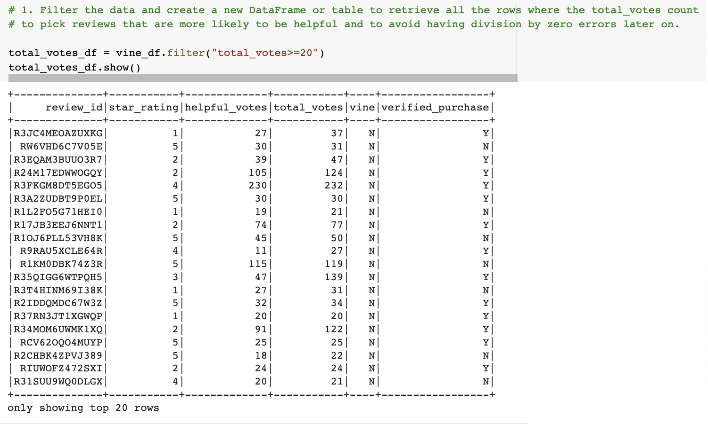

2. Filtered the new DataFrame created in Step 1 and create da new DataFrame to retrieve all the rows where the number of helpful_votes divided by total_votes is equal to or greater than 50%.

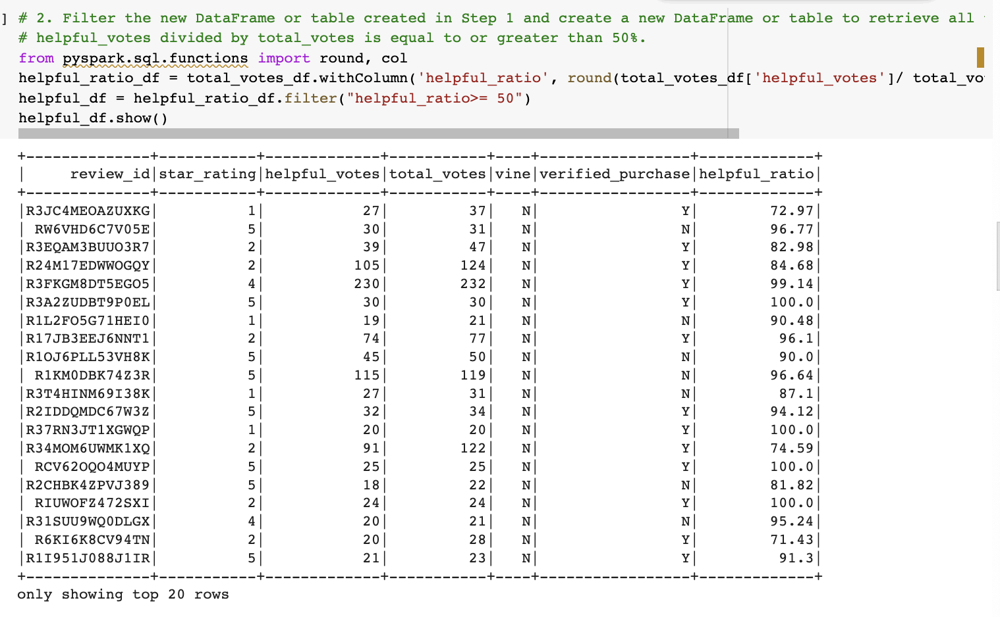

3. Filtered the DataFrame or table created in Step 2, and created a new DataFrame  that retrieves all the rows where a review was written as part of the Vine program (paid), vine == 'Y'.

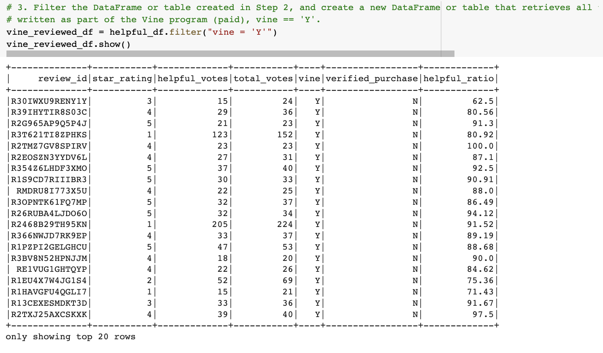

4. Repeated Step 3, but this time retrieved all the rows where the review was not part of the Vine program (unpaid), vine == 'N'.

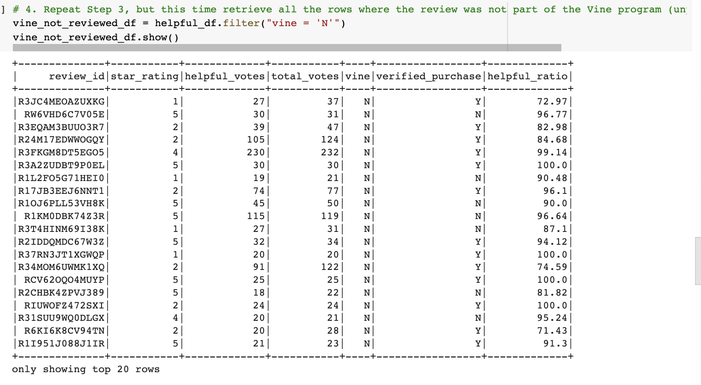

5. Determined the total number of reviews, the number of 5-star reviews, and the percentage of 5-star reviews for the two types of review (paid vs unpaid).

This step was done for both the filtered results (using the dataframes from steps 1-4 above, as well as for all of the reviews).

#### Using the Filtered Reviews

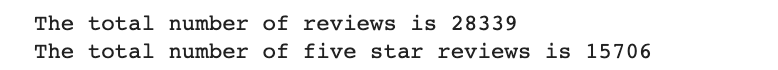

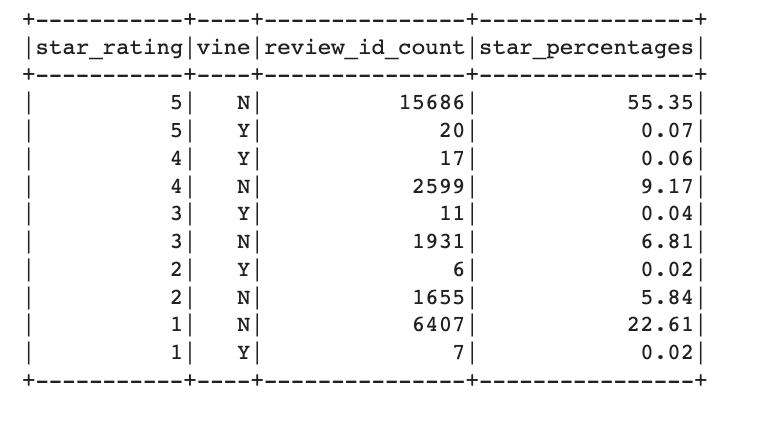

#### Using ALL reviews

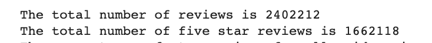

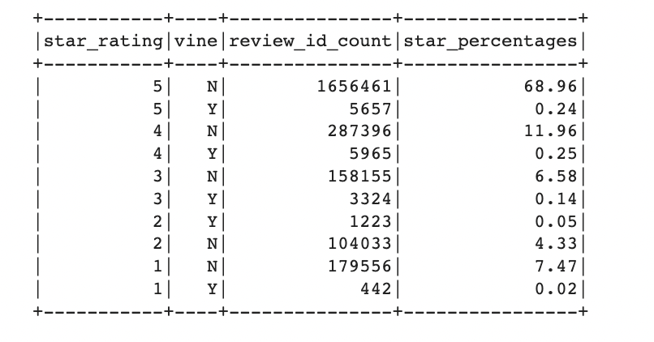

For more information on how this was done, please see the [Vine_Review_Analysis](Vine_Review_Analysis.ipynb) file.

## Results 
The results were calculated using both the filtered results as well as for ALL reviews. Please see below.

### How many Vine reviews and non-Vine reviews were there?

####  Using the Filtered Reviews
* There were 61 Vine reviews and 28,278 non-Vine reviews in total.

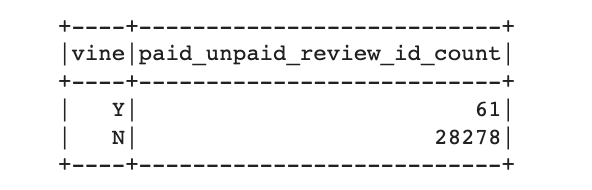

#### Using ALL reviews
* There were 16,611 Vine reviews and 2,385,601 non-Vine reviews in total.

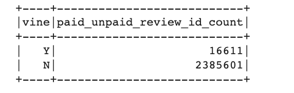

### How many Vine reviews were 5 stars? How many non-Vine reviews were 5 stars?

####  Using the Filtered Reviews
* There were 20 five-star Vine reviews and 15,686 five-star non-Vine reviews. 

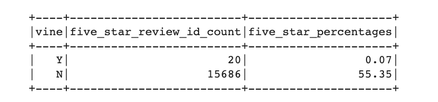

#### Using ALL reviews
* There were 5,657 five-star Vine reviews and 1,656,461 five-star non-Vine reviews. 

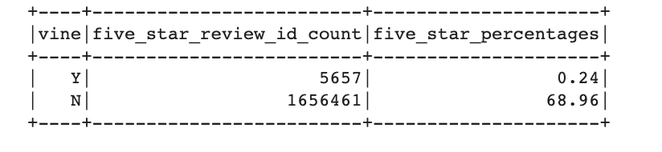

### What percentage of Vine reviews were 5 stars? What percentage of non-Vine reviews were 5 stars?

####  Using the Filtered Reviews
* Of all the filtered Vine reviews, 32.8% were five star reviews.
* Of all the filtered non-Vine reviews, 55.47% were five-star reviews.

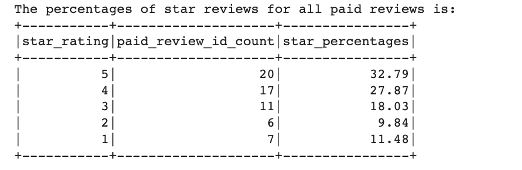

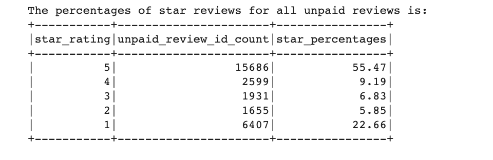

#### Using ALL reviews
* Of all the Vine reviews, 34.1% were five star reviews.
* Of all the non-Vine reviews, 69.4% were five-star reviews.

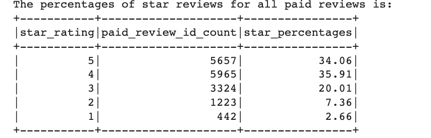

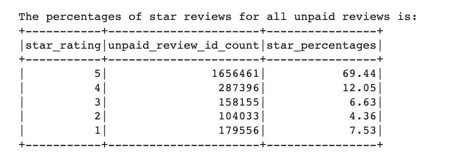

## Summary
For the grocery dataset, based on both the filtered reviews and all reviews, it is apparent that there is a bias, however not necessary positive when looking at five-star reviews specifically. It is apparent that non-vine reviews tend to have more five star ratings than vine reviews. One thing to note however, is that while vine star ratings may not have the highest five-star ratings, they did have higher 4-star ratings and 3-star ratings than the non-vine reviews for both the filtered dataframes and non-filtered dataframes. This shows that generally vine ratings are more positive than non-vine ratings. Vine ratings also had less 1-star ratings that non-vine ratings.

When looking at the distribution of all reviews across all star ratings, five-star vine reviews only account for 0.07% of all reviews in the filtered dataframe and 0.24% of all reviews in the unfiltered data frame. Whereas for non-vine reviews, 55.35% of all reviews were five-star in the filtered dataframe, and 68.96% of all reviews were fivestar in the non-filtered dataframe. 

One area that should be looked into further is whether the reviews are from a verified purchase or not to ensure the reviews are the most accurate. Additionally, perhaps the review body can be further tokenized to address what the issues are - is it with the product or delivery? 
